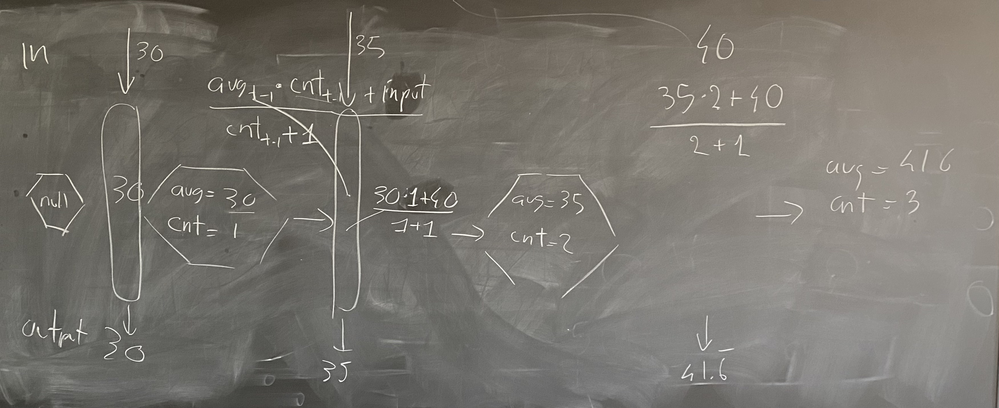
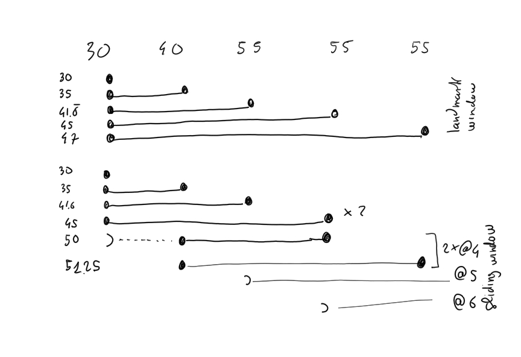

# Esper & EPL

## resources

* [espertech](https://www.espertech.com)
* [EPL documentation](http://esper.espertech.com/release-8.7.0/reference-esper/html/index.html)
* [online environment to try EPL](http://esper-epl-tryout.appspot.com/epltryout/mainform.html)

## let's get dirty

### running example

> Count the number of fires detected using a set of smoke and temperature sensors in the last 10 minutes
> A fire is detected is at the same sensor a smoke event is followed by temperature>50 event within 2 minutes


### schema of the event types for the running example

```
create schema TemperatureSensorEvent (
sensor string,
temperature double
);

create schema SmokeSensorEvent (
sensor string,
smoke boolean
);

create schema FireEvent (
sensor string,
smoke boolean,
temperature double
);
```

### data stream for the running example

```
TemperatureSensorEvent={sensor='S1', temperature=30}

SmokeSensorEvent={sensor='S1', smoke=false}

t=t.plus(1 seconds)

TemperatureSensorEvent={sensor='S1', temperature=40}

SmokeSensorEvent={sensor='S1', smoke=true}

t=t.plus(1 seconds)

TemperatureSensorEvent={sensor='S1', temperature=55}

SmokeSensorEvent={sensor='S1', smoke=true}

t=t.plus(1 seconds)

TemperatureSensorEvent={sensor='S1', temperature=55}

SmokeSensorEvent={sensor='S1', smoke=true}

t=t.plus(1 seconds)
TemperatureSensorEvent={sensor='S1', temperature=55}

SmokeSensorEvent={sensor='S1', smoke=true}

t=t.plus(4 seconds)
t=t.plus(4 seconds)
```

### let's explore the EPL syntax by example

#### Q0

the temperature events whose temperature is greater than 50 C°

##### the SQL style

```
@Name('Q0')
select *
from TemperatureSensorEvent
where temperature > 50;
```

##### THE Event-Based System Style

```
@Name('Q0bis')
select *
from TemperatureSensorEvent(temperature > 50) ;
```

NOTE: even if you cannot read it in the syntax, there is a *tumbling window of 1 event* that transforms the stream in a time-varying table that contains only an event.

#### Q1
the average of all the temperature observation for each sensor up to the last event received


```
@Name('Q1')
select sensor, avg(temperature)
from TemperatureSensorEvent
group by sensor;
```

about the incremental computation of the avg



Not all the algorithms can be converted to a streaming one, e.g., there is not **an exact** way to compute the standard deviation in a streaming algorithm. However, there is an [approximate streaming algorithm for standard deviation](https://math.stackexchange.com/questions/198336/how-to-calculate-standard-deviation-with-streaming-inputs) that **assumes** the stationarity of the observed process.


NOTE: even if you cannot read it in the syntax, there is a *landmark window* that opens when the stream starts (or when you register the query in esper) and keeps widening. As a side note, the *logical unbounded table* assumed by spark, is a landmark window; so the two words are synonyms. 

#### Q2
the average temperature observed by each sensor in the last 4 seconds (a.k.a. **sliding window**)

assumption: the average should change as soon as the receive a new event

```
@Name('Q2')
select sensor, avg(temperature)
from TemperatureSensorEvent.win:time(4 seconds)
group by sensor;
```

#### Q1's vs. Q2's results 

elaborating more on Q2 (landmark window) and the difference with Q3 (sliding window).




#### Q3
the average temperature of the last 4 seconds every 4 seconds (a.k.a. **tumbling window**)


```
@Name('Q3')
select sensor, avg(temperature)
from TemperatureSensorEvent.win:time_batch(4 seconds)
group by sensor;
```

NOTE: now is not included

if you want to include *now* you should use the `output` clause

```
@Name('Q3bis')
select avg(temperature)
from TemperatureSensorEvent.win:time(4 seconds)
group by sensor
output last every 4 seconds;
```

NOTE: I will explain `last` later on

#### Q4
the moving average of the last 4 temperature events (a.k.a. **physical sliding window**)

```
@Name('Q4')
select sensor, avg(temperature)
from TemperatureSensorEvent.win:length(4)
group by sensor;
```

#### Q5
the moving average of the last 4 temperature events every 4 events (a.k.a. **physical tumbling window**)

```
@Name('Q5')
select sensor, avg(temperature)
from TemperatureSensorEvent.win:length_batch(4)
group by sensor;
```

#### Q6
the average temperature of the last 4 seconds every 2 seconds (a.k.a. **logical hopping window**)

```
@Name('Q6')
select sensor, avg(temperature)
from TemperatureSensorEvent.win:time(4 seconds)
group by sensor
output last every 2 seconds;
```

#### Deep dive into the reporting policy specified by the `output ... every` clause

first some data

```
TemperatureSensorEvent={sensor='S1', temperature=30}
TemperatureSensorEvent={sensor='S1', temperature=31}
TemperatureSensorEvent={sensor='S1', temperature=32}
t=t.plus(1 seconds)
TemperatureSensorEvent={sensor='S1', temperature=40}
TemperatureSensorEvent={sensor='S1', temperature=41}
TemperatureSensorEvent={sensor='S1', temperature=42}
t=t.plus(1 seconds)
```

let's see the different behavior of the following queries

```
@Name('Q2')
select sensor, avg(temperature)
from TemperatureSensorEvent.win:time(4 seconds)
group by sensor;

@Name('Q2.first')
select sensor, avg(temperature)
from TemperatureSensorEvent.win:time(4 seconds)
group by sensor
output first every 1 second ;

@Name('Q2.last')
select sensor, avg(temperature)
from TemperatureSensorEvent.win:time(4 seconds)
group by sensor
output last every 1 second ;

@Name('Q2.all')
select sensor, avg(temperature)
from TemperatureSensorEvent.win:time(4 seconds)
group by sensor
output all every 1 second ;

```

as you can see last, all and snapshot gives all the same answers

if you want to see a difference between last and all, try the following

```
@Name('Q.default')
select *
from TemperatureSensorEvent.win:time(4 seconds)
;

@Name('Q.first')
select *
from TemperatureSensorEvent.win:time(4 seconds)
output first every 1 second ;

@Name('Q.last')
select*
from TemperatureSensorEvent.win:time(4 seconds)
output last every 1 second ;

@Name('Q.all')
select*
from TemperatureSensorEvent.win:time(4 seconds)
output all every 1 second ;
```

more to read in [section 5.7.1 of the EPL documentation](http://esper.espertech.com/release-8.1.0/reference-esper/html/epl_clauses.html#epl-output-options)


#### Q7

let's move on to the pattern matching part (a.k.a., the part of the language for Complex Event Processing)

let's recall the running example: find every smoke event followed by a temperature event whose temperature is above 50 °C within 2 minutes.

There is a special operator to say *followed by* (syntactically  `->`) to use within the [`pattern` clause](http://esper.espertech.com/release-8.1.0/reference-esper/html/event_patterns.html) 

let's try using it naively

```
@Name('Q7.naive')
select *
from pattern [
  s = SmokeSensorEvent(smoke=true)
  ->
  TemperatureSensorEvent(temperature > 50, sensor=s.sensor)
]
;
```

is this what we want?

indeed this *tames the torrent effect*, but is there a way to have more results?

yes, using the [`every` clause](http://esper.espertech.com/release-8.1.0/reference-esper/html/event_patterns.html#pattern-logical-every)

```
@Name('Q7.every')
select *
from pattern [
 every (
  s = SmokeSensorEvent(smoke=true)
  ->
  TemperatureSensorEvent(temperature > 50, sensor=s.sensor)
)
]
;
```

moreover, you may not like the payload of the events generated by this query

you can of course create what you want making a *projection* as in SQL

```
@Name('Q7.every.projection')
select s.sensor AS sensor, t.temperature AS temperature, s.smoke as smoke
from pattern [
 every (
  s = SmokeSensorEvent(smoke=true)
  ->
  t = TemperatureSensorEvent(temperature > 50, sensor=s.sensor)
)
]
;
```

Now, we need to insert the results in the FireEvent stream

```
@Name('Q7.insert')
insert into FireEvent
select a.sensor AS sensor,
         a.smoke AS smoke,
         b.temperature AS temperature
from pattern [
   every (
                a = SmokeSensorEvent(smoke=true)
                ->
                b = TemperatureSensorEvent(temperature > 50,  sensor=a.sensor )
                )
];
```

One last step and we have Q7 finalised. Let's add the "*within 2 minutes*" constraint.


```@Name('Q7')
insert into FireEvent
select s.sensor as sensor, s.smoke as smoke, t.temperature as temperature
from pattern [
   every (
    s=SmokeSensorEvent(smoke=true)
      -> (
    t=TemperatureSensorEvent(temperature>50,sensor=s.sensor)
    where timer:within(2 seconds) 
    )
  )  
]
;
```

NOTE: alter some statement that advance the time to change the results. E.g., change on of the last three `t=t.plus(1 seconds)` in `t=t.plus(3 seconds)`

#### Q8

we are very close to the solution of the running example, we "just" need to count the number of events generated by the previous query over a sliding window of 10 seconds. So let's count the results of  `Q7`

```
@Name('Q8')
select sensor, count(*)
from FireEvent.win:time(10 seconds);
group by sensor
```