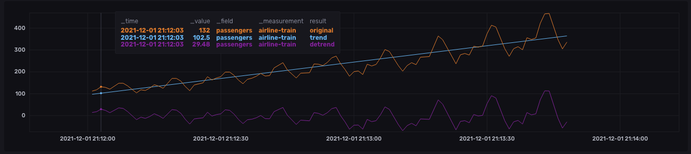
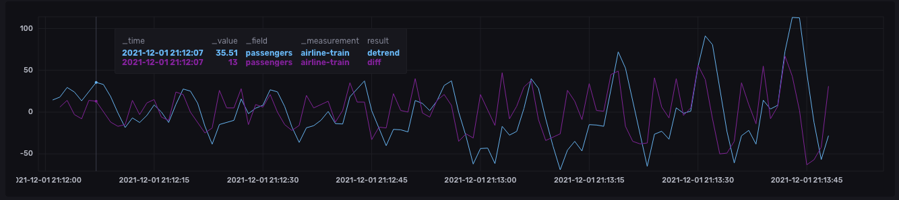

# InfluxDB & Flux - Demo
## Airline Passengers

## Set-up
### Start up the infrastructure

`docker-compose up -d`

### Open InfluxDB 2.0

1. Open [http://localhost:8086](http://localhost:8086)
2. Use the following credentials:
  * username: `admin`
	* password: `influxdb`

### start the data generator

1.  Go to [http://localhost:8888](http://localhost:8888)
2.  Password: `sda`
3.  Go to folder: `work/`
4.  Open the notebook

## ingest & show data

In Jupyter Lab at [http://localhost:8888](http://localhost:8888) open the `airline_passengers_datagen.ipynb` notebook and run all cells.

Go to the explorer pane of InfluxDB [http://localhost:8086](http://localhost:8086) and write:

```
from(bucket: "training")
  |> range(start: v.timeRangeStart, stop: v.timeRangeStop)
  |> filter(fn: (r) => r["_measurement"] == "airline-train")
  |> filter(fn: (r) => r["_field"] == "passengers")
```  

the results is


NOTE: the data spans from january 1949 to december 1960, but they are actualized and compressed 

## differentiate

```
original = from(bucket: "training")
  |> range(start: v.timeRangeStart, stop: v.timeRangeStop)
  |> filter(fn: (r) => r["_measurement"] == "airline-train")
  |> filter(fn: (r) => r["_field"] == "passengers")

original |> yield(name: "original")

original
  |> difference(nonNegative: false, columns: ["_value"])
  |> yield(name: "diff")
```

the result is


## de-trend

### find trend

```
import "contrib/anaisdg/statsmodels"

original = from(bucket: "training")
  |> range(start: v.timeRangeStart, stop: v.timeRangeStop)
  |> filter(fn: (r) => r["_measurement"] == "airline-train")
  |> filter(fn: (r) => r["_field"] == "passengers")
  |> map(fn: (r) => ({ r with _value: float(v: r._value) }))

original |> yield(name: "original")

original   
|> statsmodels.linearRegression()
|> map(fn: (r) => ({ r with _value: float(v: r.y_hat) }))
|> yield(name: "linreg")
```

the result is


### de-trend

```
import "contrib/anaisdg/statsmodels"

original = from(bucket: "training")
  |> range(start: v.timeRangeStart, stop: v.timeRangeStop)
  |> filter(fn: (r) => r["_measurement"] == "airline-train")
  |> filter(fn: (r) => r["_field"] == "passengers")
  |> map(fn: (r) => ({ r with _value: float(v: r._value) }))

original |> yield(name: "original")

trend = original   
|> statsmodels.linearRegression()
|> map(fn: (r) => ({ r with _value: float(v: r.y_hat) }))

trend |> yield(name: "trend")

trend |> map(fn: (r) => ({ r with _value: r.y - r.y_hat }))
|> yield(name: "detrend")
```

the result is 




## de-trended vs. differentiated

```
import "contrib/anaisdg/statsmodels"

original = from(bucket: "training")
  |> range(start: v.timeRangeStart, stop: v.timeRangeStop)
  |> filter(fn: (r) => r["_measurement"] == "airline-train")
  |> filter(fn: (r) => r["_field"] == "passengers")
  |> map(fn: (r) => ({ r with _value: float(v: r._value) }))

original |> yield(name: "original")

trend = original   
|> statsmodels.linearRegression()
|> map(fn: (r) => ({ r with _value: float(v: r.y_hat) }))

trend |> yield(name: "trend")

trend |> map(fn: (r) => ({ r with _value: r.y - r.y_hat }))
|> yield(name: "detrend")

diff = original 
  |> difference(nonNegative: false, columns: ["_value"])

diff
  |> yield(name: "diff")
```

the result is




