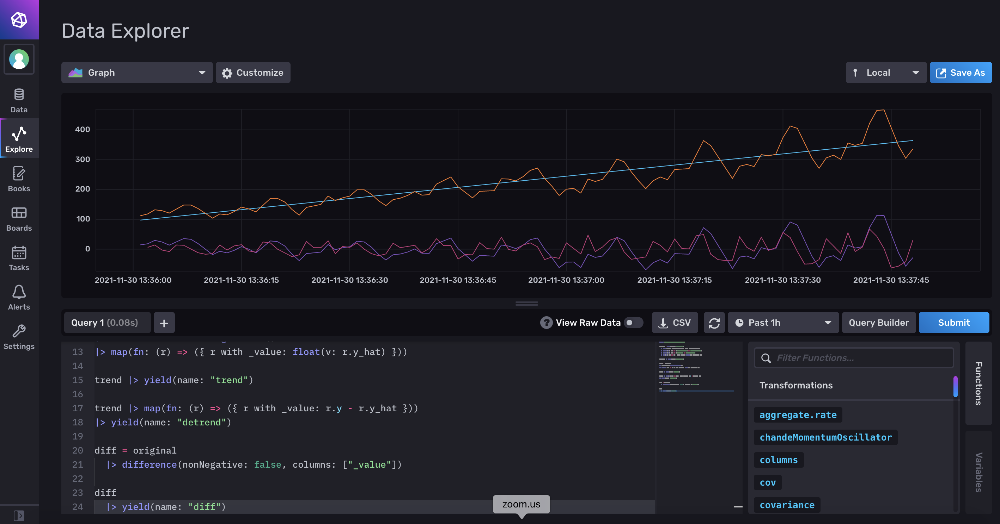

# InfluxDB & Flux - Demo
## Airline Passengers

## Set-up
### Start up the infrastructure

`docker-compose up -d`

### Open InfluxDB 2.0

1. Open [http://localhost:8086](http://localhost:8086)
2. Use the following credentials:
  * username: `admin`
	* password: `quantia-analytics`
3. Set up the instance:
	* org: `quantia`
	* bucket: `training`

### start the data generator

1.  Go to [http://localhost:8888](http://localhost:8888)
2.  Password: quantia-analytics
3.  Go to folder: work/datagen
4.  Open the notebook
5.  Enter the token in the notebooks
    * For local influxdb instance `qc-token` as token
    * For cloud instance: Go to Data > Tokens and generate a "Read/Write Token" for writing in the bucket `training`
6.  Run appropriate cells

## show data

```
from(bucket: "training")
  |> range(start: v.timeRangeStart, stop: v.timeRangeStop)
  |> filter(fn: (r) => r["_measurement"] == "airline-train")
  |> filter(fn: (r) => r["_field"] == "passengers")
```  

## differentiate

```
original = from(bucket: "training")
  |> range(start: v.timeRangeStart, stop: v.timeRangeStop)
  |> filter(fn: (r) => r["_measurement"] == "airline-train")
  |> filter(fn: (r) => r["_field"] == "passengers")

original |> yield(name: "original")

original
  |> difference(nonNegative: false, columns: ["_value"])
  |> yield(name: "diff")
```

## de-trend

### find trend

```
import "contrib/anaisdg/statsmodels"

original = from(bucket: "training")
  |> range(start: v.timeRangeStart, stop: v.timeRangeStop)
  |> filter(fn: (r) => r["_measurement"] == "airline-train")
  |> filter(fn: (r) => r["_field"] == "passengers")
  |> map(fn: (r) => ({ r with _value: float(v: r._value) }))

original |> yield(name: "original")

original   
|> statsmodels.linearRegression()
|> map(fn: (r) => ({ r with _value: float(v: r.y_hat) }))
|> yield(name: "linreg")
```

### de-trend

```
import "contrib/anaisdg/statsmodels"

original = from(bucket: "training")
  |> range(start: v.timeRangeStart, stop: v.timeRangeStop)
  |> filter(fn: (r) => r["_measurement"] == "airline-train")
  |> filter(fn: (r) => r["_field"] == "passengers")
  |> map(fn: (r) => ({ r with _value: float(v: r._value) }))

original |> yield(name: "original")

trend = original   
|> statsmodels.linearRegression()
|> map(fn: (r) => ({ r with _value: float(v: r.y_hat) }))

trend |> yield(name: "trend")

trend |> map(fn: (r) => ({ r with _value: r.y - r.y_hat }))
|> yield(name: "detrend")
```


## de-trended vs. differentiated

```
import "contrib/anaisdg/statsmodels"

original = from(bucket: "training")
  |> range(start: v.timeRangeStart, stop: v.timeRangeStop)
  |> filter(fn: (r) => r["_measurement"] == "airline-train")
  |> filter(fn: (r) => r["_field"] == "passengers")
  |> map(fn: (r) => ({ r with _value: float(v: r._value) }))

original |> yield(name: "original")

trend = original   
|> statsmodels.linearRegression()
|> map(fn: (r) => ({ r with _value: float(v: r.y_hat) }))

trend |> yield(name: "trend")

trend |> map(fn: (r) => ({ r with _value: r.y - r.y_hat }))
|> yield(name: "detrend")

diff = original 
  |> difference(nonNegative: false, columns: ["_value"])

diff
  |> yield(name: "diff")
```




