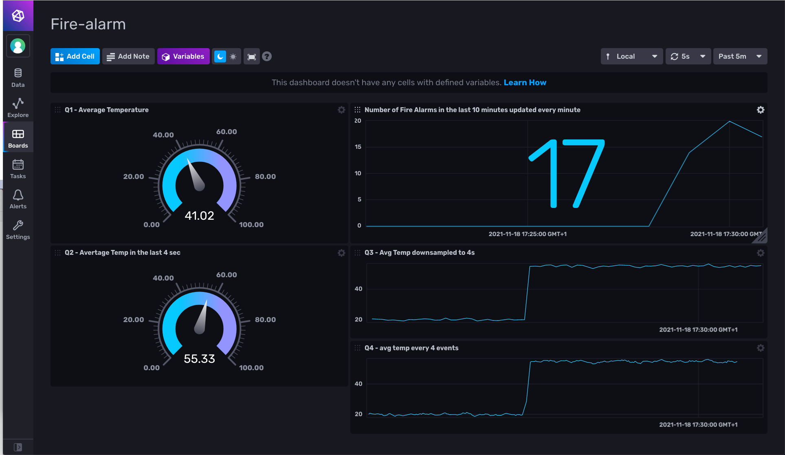
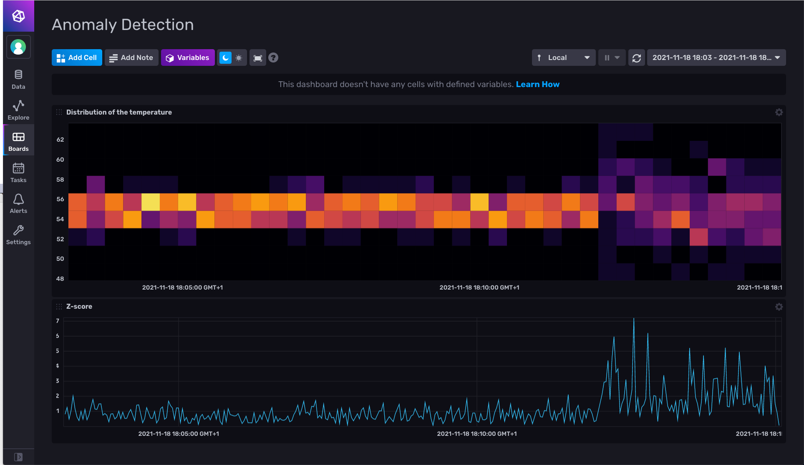

# InfluxDB & Flux - Demo
## Fire alarm

## set up
### start up the infrastrucutre

```docker-compose up -d```

### start the data generator

1.  Go to [http://localhost:8888](http://localhost:8888)
2.  Password: sda
3.  Go to folder: work
4.  Open the two notebooks
5.  Go to the temperature_sensor_simulator.ipynb notebook and run the first 4 cells 
6. 	 Go to the smoke_sensor_simulator.ipynb notebook and run the first 4 cells

NOTE: sending temperature and smoke events that do not allow detecting fire

### Open InfluxDB 2.0

1. Open [http://localhost:8086](http://localhost:8086)
2. log in:
	* user: admin
	* psw: influxdb 


## queries

### NOTES

* use the explorer panel selecting the script editor
* for a good visualization:
	* set the time range selector to `Past 5 minutes`
	* choose the appropriate graph from the drop down menu

### Q0

sensors that measure a temperature above 20 C (was 50 in EPL)

```
from(bucket: "training")
  |> range(start: v.timeRangeStart, stop: v.timeRangeStop)
  |> filter(fn: (r) => r._measurement == "TemperatureSensorEvent")
  |> filter(fn: (r) => r._field == "temperature")
  |> filter(fn: (r) => r.sensor == "S1")
  |> filter(fn: (r) => r._value > 20)
```

NOTE: best view using graph

### Q1 - Avg

the average temperature observed by the sensors

```
from(bucket: "training")
  |> range(start: v.timeRangeStart)
  |> filter(fn: (r) => r._measurement == "TemperatureSensorEvent")
  |> filter(fn: (r) => r._field == "temperature")
  |> filter(fn: (r) => r.sensor == "S1")
  |> mean()
```

Landmark windows in Flux allows to express landmark windows by specifying only the `start` of a `range` function. 

NOTE:
 
* best view using: Gauge
* you may want to save the query as a cell in a dashboard

### Q2 - Logical Sliding Window

The average temperature observed by each sensor in the last 4 seconds

Partially supported. Flux allows to specify relative windows that moves on every time you evaluate them.

```
from(bucket: "training")
  |> range(start: -4s)
  |> filter(fn: (r) => r._measurement == "TemperatureSensorEvent")
  |> filter(fn: (r) => r._field == "temperature")
  |> filter(fn: (r) => r.sensor == "S1")
  |> mean()
```

NOTE:
 
* best view using: Gauge
* you may want to save the query as a cell in a dashboard

### Q3 - Logical Tumbling Window

the average temperature observed by the sensors in the 4 seconds

```
from(bucket: "training")
  |> range(start: -4s)
  |> filter(fn: (r) => r._measurement == "TemperatureSensorEvent")
  |> filter(fn: (r) => r._field == "temperature")
  |> filter(fn: (r) => r.sensor == "S1")
  |> aggregateWindow(every: 4s, fn: mean, createEmpty: false)
```

NOTE: save as a Task, but in order to distinguish the result from the original data, we overwrite the `_measurament` with `TemperatureSensorEventAvg4s"` using another `map()`


```
option task = { 
  name: "Q3 - Logical Tumbling Window",
  every: 4s,
}

from(bucket: "training")
  |> range(start: -4s)
  |> filter(fn: (r) => r._measurement == "TemperatureSensorEvent")
  |> filter(fn: (r) => r._field == "temperature")
  |> filter(fn: (r) => r.sensor == "S1")
  |> aggregateWindow(every: 4s, fn: mean, createEmpty: false)
  |> map(fn: (r) => ({ r with _measurement: "TemperatureSensorEventAvg4s" }))  
  |> to(bucket: "training", org: "sda")
```

optionally add a cell to the dashbaord

```
from(bucket: "training")
  |> range(start: v.timeRangeStart, stop: v.timeRangeStop)
  |> filter(fn: (r) => r._measurement == "TemperatureSensorEventAgv4s")
  |> filter(fn: (r) => r._field == "temperature")
  |> filter(fn: (r) => r.sensor == "S1")
```

### Q4 - Physical Sliding Window

the average temperature observed by the sensors in the last 4 events

Partially supported. Flux allows to specify physical sliding windows using `movingAverage()`, but the window moves on every time you evaluate the query.

```
from(bucket: "training")
  |> range(start: v.timeRangeStart, stop: v.timeRangeStop)
  |> filter(fn: (r) => r._measurement == "TemperatureSensorEvent")
  |> filter(fn: (r) => r._field == "temperature")
  |> filter(fn: (r) => r.sensor == "S1")
  |> movingAverage(n: 4)
```

As for Q3, you can rename the measurement and register the query as a task.

```
option v = {timeRangeStart: -10s, timeRangeStop: now()}
option task = {name: "Q4 - Physical Sliding Window", every: 10s}

from(bucket: "training")
	|> range(start: v.timeRangeStart, stop: v.timeRangeStop)
	|> filter(fn: (r) =>
		(r._measurement == "TemperatureSensorEvent"))
	|> filter(fn: (r) =>
		(r._field == "temperature"))
	|> filter(fn: (r) =>
		(r.sensor == "S1"))
	|> movingAverage(n: 4)
	|> map(fn: (r) =>
		({r with _measurement: "TemperatureSensorEventAvg4events"}))
	|> to(bucket: "training", org: "sda")
```

### Q5 - Physical Tumbling Window

the average temperature observed by the sensors in the last 4 events updating the window after 4 events

***Not supported***

### Q6 - Logical Hopping Window

The average temperature of the last 4 seconds every 2 seconds

Partially supported. Flux allows to specify Logical Hopping Windows using `timedMovingAverage()`, but the window moves on every time you evaluate the query.

```
from(bucket: "training")
  |> range(start: v.timeRangeStart, stop: v.timeRangeStop)
  |> filter(fn: (r) => r._measurement == "TemperatureSensorEvent")
  |> filter(fn: (r) => r._field == "temperature")
  |> filter(fn: (r) => r.sensor == "S1")
  |> timedMovingAverage( every: 4s, period: 2s) 
```

### Q7 - Stream-to-Stream Join

See the lecture notes. Here, as in the previous pratical sessions, we discuss the ability of FLux to encode EPL patterns. Differently from Spark Structured Streaming and KSQL, FLux can express `every (a = SmokeSensorEvent(smoke=true) -> TemperatureSensorEvent(temperature > 50, sensor=a.sensor) where timer:within(1 min)`. 

```
temp = from(bucket: "training")
  |> range(start: v.timeRangeStart, stop: v.timeRangeStop)
  |> filter(fn: (r) => r._measurement == "TemperatureSensorEvent")
  |> filter(fn: (r) => r._field == "temperature")
  |> filter(fn: (r) => r.sensor == "S1")
  |> aggregateWindow(every: 3s, fn: mean)


smoke = from(bucket: "training")
  |> range(start: v.timeRangeStart, stop: v.timeRangeStop)
  |> filter(fn: (r) => r._measurement == "SmokeSensorEvent")
  |> filter(fn: (r) => r._field == "smoke")
  |> filter(fn: (r) => r.sensor == "S1")
  |> aggregateWindow(every: 3s, fn: last)

join(tables: {key1: smoke, key2: temp}, on: ["_time"], method: "inner")
```

**IMPORTANT** To detect fire, run the appropriate cells in the data generators.

### Q9 - Count FireEvent

Register Q8 as a task remembering the data model un InfluxDB (`_measurement`, `_field`, `_value`, and `_time` must be always present!

```
option task = {name: "FireAlarm", every: 1m}

temp = from(bucket: "training")
  |> range(start: v.timeRangeStart, stop: v.timeRangeStop)
  |> filter(fn: (r) => r._measurement == "TemperatureSensorEvent")
  |> filter(fn: (r) => r._field == "temperature")
  |> filter(fn: (r) => r.sensor == "S1")
  |> aggregateWindow(every: 3s, fn: mean)


smoke = from(bucket: "training")
  |> range(start: v.timeRangeStart, stop: v.timeRangeStop)
  |> filter(fn: (r) => r._measurement == "SmokeSensorEvent")
  |> filter(fn: (r) => r._field == "smoke")
  |> filter(fn: (r) => r.sensor == "S1")
  |> aggregateWindow(every: 3s, fn: last)

join(tables: {s: smoke, t: temp}, on: ["_time"], method: "inner")
	|> map(fn: (r) =>
		({r with _measurement: "fireAlarm"}))
	|> map(fn: (r) =>
		({r with _field: "detected"}))
	|> map(fn: (r) =>
		({r with _value: true}))
	|> rename(columns: {_value_s: "smoke", _value_t: "temperature"})
	|> keep(columns: ["_time", "sensor", "_measurement", "smoke", "temperature", "_field", "_value"])
  |> to(bucket: "training", org: "sda")
```

... and now the last query

```
from(bucket: "training")
  |> range(start: -10m, stop: now())
  |> filter(fn: (r) => r._measurement == "fireAlarm")
  |> aggregateWindow(every: 1m, fn: count)
```

to register as a cell in the dashboard.

### The resulting tasks and dashboard

Here are the exports of:
* task [Q3 - Logical Tumbling Window](./exports/tasks/q3_-_logical_tumbling_window.json) 
* task [Q4 - Physical Sliding Window](./exports/tasks/q4_-_physical_sliding_window.json) 
* task [fire-alarm](./exports/tasks/firealarm.json) 
* the [dashboard](./exports/dashboards/fire-alarm.json).



### Bonus Content 
#### Anomaly Detection

Anomaly detection is a challenging data analysis task. Anomalies can represent spurious data to clean out and important patterns to detect.
This generality makes anomaly detection a powerful tool used in network security, remote sensing, fault detection, and many other domains

The intuition behind Anomaly Detection is simple:  

> Considering the distribution of the data point in a time series, anomalous points are anomalies, a.k.a. outliers.


Let’s operationalize this intuition using the Z score


Hereafter, you find the code of a task that computes the 
  
```
import "date"
import "math"

option v = {bucket: "", timeRangeStart: -15m, timeRangeStop: now()}
option task = {name: "Zscore of sensor observations", every: 5m}

movingAvg = from(bucket: "training")
	|> range(start: v.timeRangeStart, stop: v.timeRangeStop)
	|> filter(fn: (r) =>
		(r._measurement == "TemperatureSensorEvent"))
	|> filter(fn: (r) =>
		(r._field == "temperature"))
	|> filter(fn: (r) =>
		(r.sensor == "S1"))
	|> aggregateWindow(every: 5m, fn: mean, createEmpty: false)
	|> filter(fn: (r) =>
		(r._stop != r._time))
	|> drop(columns: ["_start", "_stop", "host"])
movingStddev = from(bucket: "training")
	|> range(start: v.timeRangeStart, stop: v.timeRangeStop)
	|> filter(fn: (r) =>
		(r._measurement == "TemperatureSensorEvent"))
	|> filter(fn: (r) =>
		(r._field == "temperature"))
	|> filter(fn: (r) =>
		(r.sensor == "S1"))
	|> aggregateWindow(every: 5m, fn: stddev, createEmpty: false)
	|> filter(fn: (r) =>
		(r._stop != r._time))
	|> drop(columns: ["_start", "_stop", "host"])
join1 = join(tables: {avg: movingAvg, stddev: movingStddev}, on: ["_time"], method: "inner")
	|> rename(columns: {_field_avg: "_field"})
	|> rename(columns: {_measurement_avg: "_measurement"})
	|> rename(columns: {sensor_avg: "sensor"})
allData = from(bucket: "training")
	|> range(start: v.timeRangeStart, stop: v.timeRangeStop)
	|> filter(fn: (r) =>
		(r._measurement == "TemperatureSensorEvent"))
	|> filter(fn: (r) =>
		(r._field == "temperature"))
	|> filter(fn: (r) =>
		(r.sensor == "S1"))
	|> drop(columns: ["_start", "_stop", "host"])
join2 = join(tables: {all: allData, j: join1}, on: ["_field", "_measurement", "sensor"])
	|> filter(fn: (r) =>
		(uint(v: r._time_all) - uint(v: r._time_j) > 0))
	|> filter(fn: (r) =>
		(uint(v: r._time_all) - uint(v: r._time_j) <= 5 * 60 * 1000000000))
	|> rename(columns: {_time_all: "_time"})
	|> map(fn: (r) =>
		({r with _value: math.abs(x: (r._value - r._value_avg) / r._value_stddev)}))
	|> map(fn: (r) =>
		({r with _field: "zScore"}))
	|> map(fn: (r) =>
		({r with _measurement: "TemperatureSensorEventZscore"}))

join2
	|> to(bucket: "training", org: "sda")
```

Using [this export of the Task](./exports/tasks/zscore_of_sensor_observations.json), [this dashboard](./exports/dashboards/anomaly_detection.json) and running the appropriate cell in the [temperature data generator], you should get something that looks like the following figure.



## Tear down the stack

When you're done, tear down the stack by running:

```
docker-compose down
```
